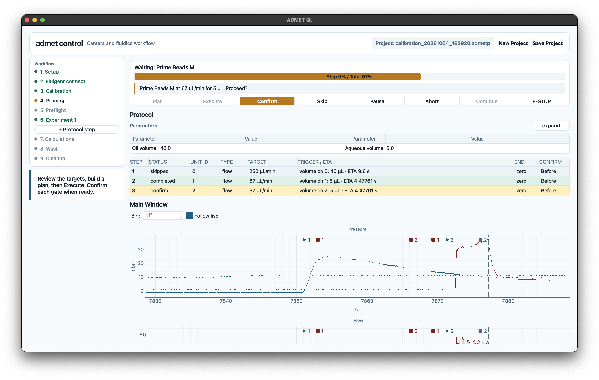
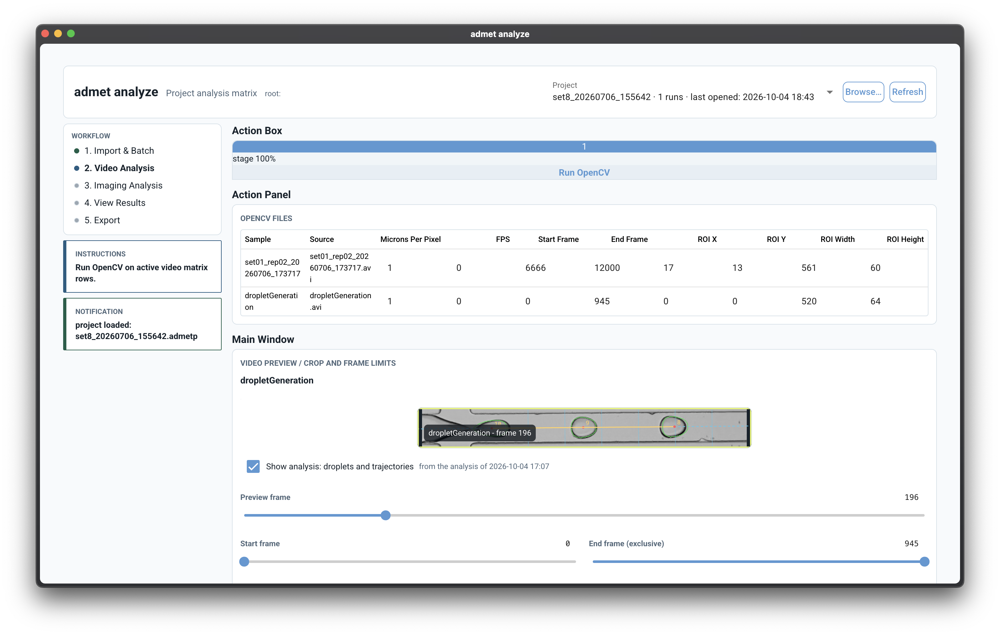

<p align="center">
  
</p>

<h1 align="center">ADMET</h1>

<p align="center">
  <b>Automatic Droplet Management Extended Toolkit</b><br>
  Drive a Fluigent rig and camera, record every run, and analyse the droplets
  from one project folder.
</p>

---

ADMET is one Python package with two apps:

- **`admet control`** — a desktop app that drives the flow units and camera,
  runs validated JSON protocols with operator gates, records fluidics and video,
  and calculates results such as fluid density, gravimetry, dead volume and
  viscosity.
- **`admet analyze`** — a web server for the lab network that reads the same
  projects and analyses them: OpenCV droplet tracking for videos, Cellpose for
  images. It never touches the rig.

<p align="center">
  
  
</p>

## Quick start

ADMET needs Python 3.12 and [uv](https://docs.astral.sh/uv/).

```bash
git clone https://github.com/merv1n34k/admet.git
cd admet

# Control PC
uv sync --locked --extra control
uv run --locked --extra control admet control

# Analysis server (every interface, port 8080)
uv sync --locked --extra analyze
uv run --locked --extra analyze admet analyze
```

No hardware? On the Fluigent page, choose **Simulated Hardware** before
connecting. For live use, install the Fluigent and Basler drivers and
[Fluigent's SDK](https://github.com/Fluigent/fgt-SDK).

> [!NOTE]
> The Fluigent SDK has no native support for macOS on Apple Silicon. Use a
> Windows or Linux PC to drive a Fluigent rig.

## Features

- **Projects** — one `.admetp` folder per experiment: protocols as they ran,
  fluidics and video recordings, typed-in measurements and every calculated
  result, each fingerprinted so a changed input marks it outdated.
- **Protocols as JSON** — steps, parameters with expressions, gates,
  measurements and calculations in one file. Plans are previewed before anything
  moves; runs can be paused, skipped and resumed.
- **Calibration you can check** — gravimetry weighs what each flow unit delivers
  and suggests the correction to enter, then confirms it on the next run.
- **Manual control** — hand-set commands that end on volume, time or a reading,
  with adaptive volume stops that learn each channel's tail.
- **Analysis** — a batch matrix of videos and image folders, prefilled from the
  recordings, with contours and trajectories drawn over the preview.

## Documentation

The full documentation lives in [`docs/`](docs/) and is built with VitePress:

```bash
make docs-dev      # http://localhost:5173
```

| Topic | |
|---|---|
| [Installation](docs/guide/installation.md) | Windows control PC, drivers, project folders |
| [admet control](docs/control/overview.md) | The workflow, calibration, protocols, safety |
| [admet analyze](docs/analyze/overview.md) | Serving and analysing projects |
| [Protocol format](docs/protocols/format.md) | Writing your own protocols |
| [Calculations](docs/calculations/gravimetry.md) | How each result is calculated |
| [Python API](docs/reference/python-api.md) | Scripting runs |

## Development

```bash
make setup         # install every extra
make test          # core and control tests
make test-all      # plus simulated integration and analysis tests
make lint
```

Tests use the Fluigent simulator and mocked cameras; no device is needed.
Simulation does not validate wiring, liquid calibration or Windows drivers.

> [!WARNING]
> Keep the physical emergency stop within reach. ADMET's software stop cannot
> recover from a blocked SDK, a lost USB link or a power cut.

## Background

ADMET extends the idea of Automated Droplet Measurement (ADM):

> Z. Z. Chong, S. B. Tor, A. M. Gañán-Calvo, Z. J. Chong, N. H. Loh, N.-T. Nguyen, S. H. Tan.
> Automated droplet measurement (ADM): an enhanced video processing software for rapid droplet
> measurements. *Microfluidics and Nanofluidics* **20**, 66 (2016).
> [doi:10.1007/s10404-016-1722-5](https://doi.org/10.1007/s10404-016-1722-5)

## License

Distributed under the GNU Affero General Public License v3.0. See [`LICENSE`](LICENSE) for more information.
